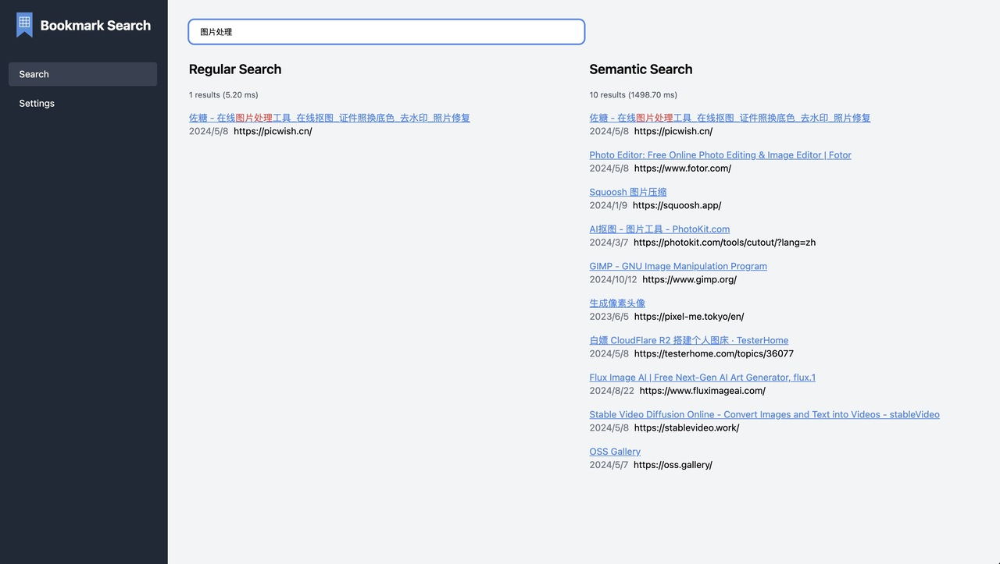
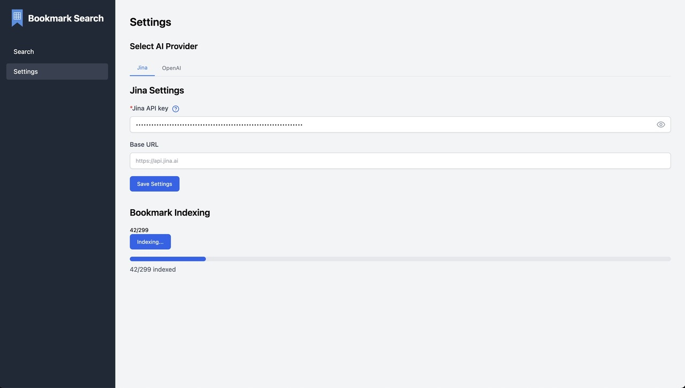

# Bookmark Search


Bookmark Search is a powerful AI-driven Chrome extension designed to help users quickly find their bookmarks. This tool not only provides intelligent search functionality but also features a user-friendly interface and high-performance efficiency.

[View Chrome Extension](https://chromewebstore.google.com/detail/bookmark-search/jigokhdddadhminchmmfcpihhpnfhecj?hl=zh-CN&utm_source=ext_sidebar)



## Key Features

- **Smart Semantic Search**: Use natural language queries to find bookmarks, even if you don't remember the exact title.
- **Fast and Efficient**: Quickly search through large numbers of bookmarks without performance issues.
- **User-Friendly**: Intuitive interface makes bookmark searching easy.
- **Dual Search Modes**: Offers both regular keyword search and semantic search modes.



## How to Use

1. **Set up AI Provider**:

   - In Settings, choose your AI Provider (Jina AI or OpenAI).

2. **Configure API**:

   - Set up your API key.
   - Optionally, set a base URL (if required).

3. **Create Bookmark Index**:

   - Click the "Add to Index" button to add your bookmarks to the search index.

4. **Start Searching**:
   - Enter your query in the search box.
   - Use Regular Search for keyword matching or Semantic Search for AI-powered understanding.

Bookmark Search combines traditional keyword search with advanced AI-driven semantic search, providing a comprehensive and powerful bookmark management solution that improves work efficiency and enhances the overall browsing experience.

## Technology Stack

Bookmark Search is built using a modern and efficient technology stack:

- **Plasmo**: A powerful framework for building browser extensions, providing a smooth development experience.
- **Tailwind CSS**: A utility-first CSS framework for rapid UI development.
- **IndexedDB (via idb)**: A low-latency, high-performance client-side storage solution for structured data.
- **Embedding**: Utilizes AI-powered embedding techniques for semantic search functionality.

This combination of technologies ensures a fast, responsive, and intelligent bookmark search experience.

## Development with Plasmo

To start developing with the Plasmo framework:

1. **Install Dependencies**:

   ```
   pnpm install
   ```

2. **Start Development Server**:

   ```
   pnpm dev
   ```

3. **Build for Production**:

   ```
   pnpm build
   ```

4. **Load Extension in Chrome**:
   - Open Chrome and go to `chrome://extensions/`
   - Enable "Developer mode"
   - Click "Load unpacked" and select the `build/chrome-mv3-dev` folder

These commands will help you set up the development environment, start the development server, build the extension for production, and load it into Chrome for testing.
